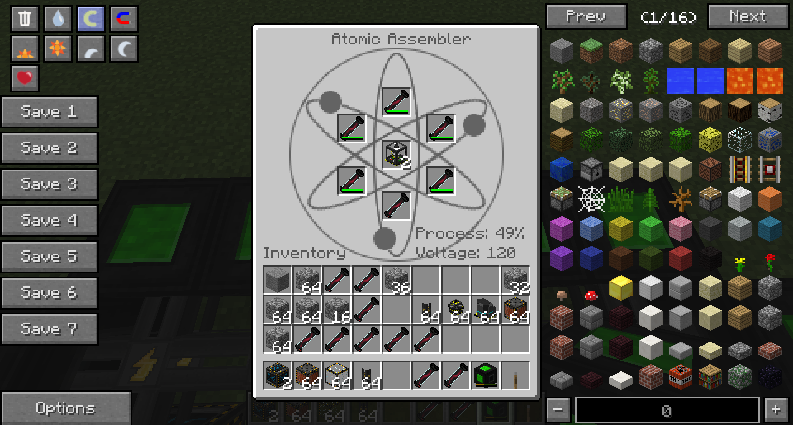
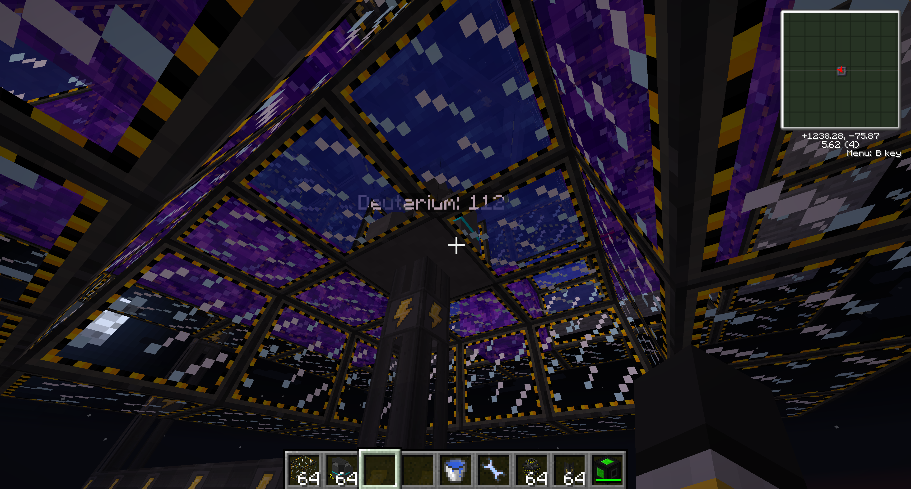
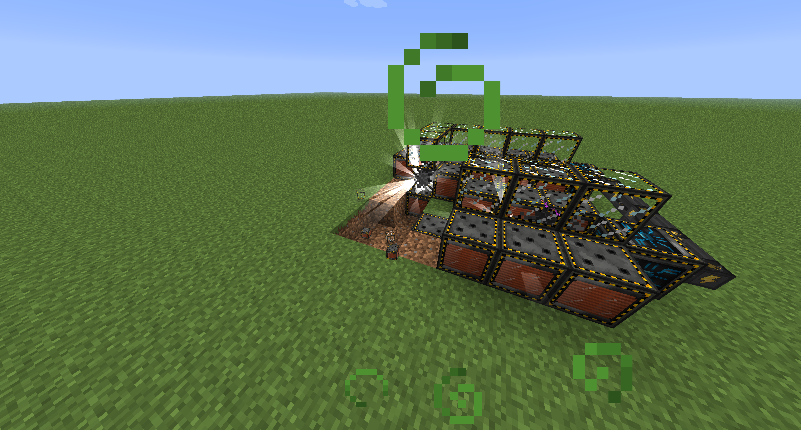
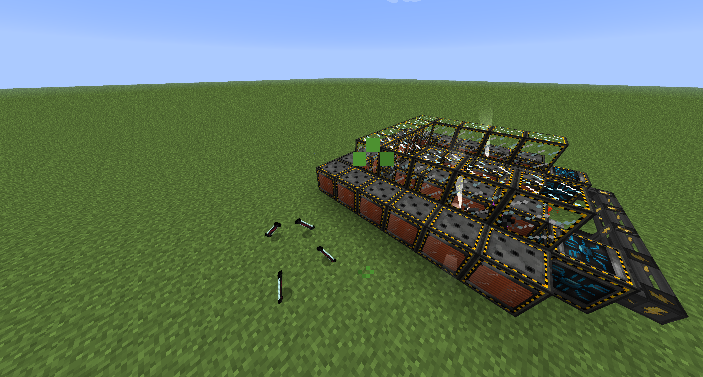
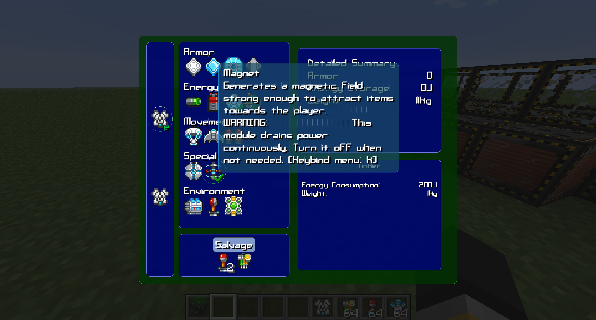

# Voltz 1.5.2 fixes

Bug fixes for mods in the **Voltz** modpack (Minecraft 1.5.2), applied as bytecode
patches to the shipped jars. No mod source is used or required.

Every claim in this document was verified by disassembling the jars and by server-side
telemetry captured on a 1.5.2 Forge test server — not from memory, wikis, or guesswork.

**These are server-side patches and they work against an unmodified Voltz client.**
Install them on the server only. Players connect with the stock modpack, install nothing,
and change nothing — every fix runs in server-side code.

Each patch is selectable individually, and the patcher fails the build if a selected
patch does not apply, so it can never write a jar that silently did nothing.

| Mod | Patches |
|---|---|
| [Atomic Science v0.6.2.117](#atomic-science-v062117) | `assemblerwear` · `syncspawn` · `plasma` · `noblastdamage` |
| [MPS Addons 0.2.3](#mps-addons-023) | `magnet` |
| [MFFS 3.1.0 — BalancedMFFS](#mffs-310--balancedmffs) | `zones` · `logging` |

---

## Atomic Science v0.6.2.117

Four fixes for particle accelerator, fusion reactor and Atomic Assembler bugs. The
patcher rewrites five classes in `Atomic_Science_v0.6.2.117.jar` and adds one.

<details>
<summary><b>1. <code>assemblerwear</code> — the Assembler only wears 5 of its 6 cells</b></summary>

**The bug.** `TGouCheng.yong()` checks all six slots for a strange matter cell, then
wears them in a loop that stops one short:

```java
if (nengYong()) {
    for (int i = 0; i < 5; i++) {        // requires 6 cells, damages 5
        if (containingItems[i] != null) {
            containingItems[i].setItemDamage(containingItems[i].getItemDamage() + 1);
            if (containingItems[i].getItemDamage() >= 64) containingItems[i] = null;
        }
    }
```

Slot 5's cell is checked for presence every cycle and never takes a point of damage, so
it lasts forever. Real cost is **5 cells per 64 duplications instead of 6**.

**The patch.** The loop bound becomes `VoltzFixConfig.assemblerSlots` — 6 when enabled,
5 when not. Targeted by the `ICONST_5` immediately followed by `IF_ICMPGE` inside
`yong()`; the build fails unless exactly one such site exists.



*All six cells loaded and wearing. Before the patch the bottom slot's cell sat at full
durability forever while the other five ground down.*

</details>

<details>
<summary><b>2. <code>syncspawn</code> — accelerators desync on placement</b></summary>

**The bug.** `TJiaSuQi.ticks` starts at `0` when the TileEntity is *constructed*, and
the particle spawn gate is:

```java
if (wattsReceived >= 10000 && slot0 != null && ticks % 20 == 0) { spawn }
```

Two accelerators placed at different moments carry a permanent phase offset. Their
particles never meet at the midpoint of the tube, so the pair produces nothing — and a
lone particle flies the full corridor and detonates on the machine. The only cure is a
world reload, which reconstructs both TileEntities on the same tick.

This is why a freshly built accelerator is a coin flip, and why *repairing* one breaks it.

**Measured.** Re-placing one accelerator left it **5 ticks** out of phase and more than
halved output. A later re-place left them **9 ticks** out, and every cycle detonated a
lone particle with nothing within 4.28 blocks:

```
t=52176  suDu=0.08931  cell=1271/4/-76  dist=0.10201  expl=false
t=52275  suDu=0.15300  cell=1276/4/-76  dist=4.28307  expl=true    <- alone
```

**The patch.** Gate on world time instead of the per-machine counter:

```
before:  this.ticks % 20 == 0
after:   VoltzFixConfig.spawnClock(world.getWorldTotalTime(), this.ticks) % 20 == 0
```

`spawnClock` returns world time when the option is on and the original counter when it
is off, so every accelerator shares one clock regardless of placement order.
**No restart is ever needed.** `getWorldTotalTime` (`func_82737_E`) is the
monotonic counter and is *not* moved by `/time set` — verified, because the alternative
`func_72820_D` is the day clock.

Only the spawn gate is touched. It is identified by the `LDC 20L` that follows it, so the
unrelated `ticks % 5` packet-send gate is left alone.

The before/after pair in the `noblastdamage` section below shows the combined effect: a
synced pair colliding cleanly, and nothing left standing when they don't.

</details>

<details>
<summary><b>3. <code>plasma</code> — stranded plasma is permanent and lethal</b></summary>

**The bug.** `BDengLiZiTi` (plasma) gets exactly one decay tick, scheduled in
`onBlockAdded`:

```java
world.scheduleBlockUpdate(x, y, z, blockID, getBlockMetadata(world) * 5);
```

The fusion reactor spawns plasma at metadata 7, so that is 35 ticks. **Nothing re-arms
it.** `onBlockAdded` never runs again for an existing block, and the only other scheduler
is `onNeighborBlockChange`. If that pending entry is ever lost, the block is permanent.

That matters because touching plasma is instant death — no armour helps — and it deletes
any item that falls into it rather than dropping it.

A stuck block also **deadlocks the reactor**. The spawn cell two blocks out from the
reactor's facing side fails `canPlace`, so `spawn()` becomes a no-op — but the 20,000 W
and the deuterium are consumed anyway. And the heat that drives the boiler is a one-shot
`+100 °C` pulse delivered in `onBlockAdded`, so plasma merely sitting there contributes
nothing: no new placements, no heat, no steam, no power. The reactor burns fuel forever
at zero output with nothing anywhere reporting a fault.

The only recovery in the stock mod is `onNeighborBlockChange` — changing a block next to
the plasma schedules its decay. That means breaking into a containment full of something
that kills you on contact, and opening the shell lets the plasma out: it spreads at 80%
per face and **replaces** anything that isn't bedrock, an iron block, or an electromagnet.

**The patch.** `setTickRandomly(VoltzFixConfig.plasmaDecay)` in the constructor. Random
ticks are re-derived from the chunk every tick and cannot be lost, and `updateTick`
unconditionally converts plasma to fire, so any orphan dies on its next random tick. The
normal 35-tick scheduled decay still fires first; this is purely a backstop.



</details>

<details>
<summary><b>4. <code>noblastdamage</code> — particle explosions destroy your machine</b></summary>

**The bug.** A correctly running accelerator detonates a survivor on its own
electromagnet **every single cycle**. Not an accident — normal operation:

```
collision separations: {'0.20017': 31, '-1.00000': 31}
```

31 of 31 survivors died with nothing in range, at `cell=1270/4/-76`, `blockAt=3778`,
`suDu=0.59452` — strength `0.59452 * 2.5 = 1.486` onto a magnet, once per 420 ticks.

Whether a given blast eats the block is **vanilla RNG**: `Explosion.doExplosionA` casts
rays with `f = size * (0.7F + rand.nextFloat() * 0.6F)`, so the effective radius varies
±30% per explosion. Identical blasts destroy different blocks. That is the entire source
of "it randomly blew up after working for hours" — the machine was firing survivable
blasts the whole time and one finally rolled high.

**The patch.** `World.createExplosion(e,x,y,z,size,flag)` routes `flag` to `isSmoking`:

```java
return newExplosion(e, x, y, z, size, false /*isFlaming*/, flag /*isSmoking*/);
```

and `Explosion.doExplosionB` gates the **entire** block-destruction loop on it
(`getfield b:Z` / `ifeq`), while entity damage and knockback happen in `doExplosionA`,
which runs regardless. The argument becomes `VoltzFixConfig.blastDamage`, so switching it
off removes all block damage and block drops while leaving the knockback — which is the
strange-matter production mechanism — completely intact.

There is exactly **one** `createExplosion` call site in `EWuSu`, inside `explode()`, and
every path reaches it (collision, `!canCunZai`, `isCollidedHorizontally`).

**Verified.** 31+ explosions landing directly on electromagnets, **zero blocks lost**,
against a stock baseline of roughly 1 block per 16 knocks.

**Configurable** — see below. Default is damage off.

**Before**



**After**



</details>

<details>
<summary><b>Configuration</b></summary>

The four Atomic Science patches are toggleable in `config/VoltzFixes.cfg`, written at mod init. Every
option defaults to the fixed behaviour; set one to `false` to restore stock Atomic
Science for that fix alone. No rebuild needed.

```
general {
    B:"Assembler Wears All Six Cells"=true
    B:"Disable Explosion Block Damage"=true
    B:"Plasma Self Decay Backstop"=true
    B:"Sync Accelerator Spawns To World Time"=true
}
```

| Option | `true` (default) | `false` |
|---|---|---|
| Assembler Wears All Six Cells | consumes all 6 cells | stock: slot 5 never wears |
| Disable Explosion Block Damage | no block damage or drops; knockback intact | stock: blasts destroy blocks |
| Plasma Self Decay Backstop | plasma ticks randomly, orphans still decay | stock: one scheduled tick only |
| Sync Accelerator Spawns To World Time | one shared clock, placement order irrelevant | stock: per-machine counter |

The values are read at startup and logged, so you can confirm what is active:

```
[VoltzFixes] blastDamage=false syncSpawn=true plasmaDecay=true assemblerSlots=6
```

Note `blastDamage` is the internal inverse of the user-facing
`Disable Explosion Block Damage`.

Turning **Disable Explosion Block Damage** off is only sensible if a third injector
suppresses the blast — otherwise a correctly synced accelerator detonates a survivor on
its own electromagnet every cycle and the machine slowly eats itself.

</details>

<details>
<summary><b>Known-good telemetry</b></summary>

What a correctly running accelerator pair looks like — use this to diagnose:

| Metric | Value |
|---|---|
| Spawn events | both accelerators, **same tick**, phase constant |
| Collision separation | **0.20017**, identical every cycle |
| Cycle length | **420 ticks** |
| Knocks | **100%** of collisions, `0.07531 -> 0.59732` |
| Survivor death | `suDu=0.59452`, on an electromagnet |
| Output | ~1 strange matter cell per 2.7 min |

Deviations and what they mean:

- **540-tick solo cycle** — one accelerator is out of cobble. Hand-filled hoppers never
  hold the same amount, so one always empties first and the other fires unpaired
  particles into your machine. This is the most common real-world failure. Automate it.
- **`dist` in the 0.377–0.700 range** — dead band. The collision is *detected* (box is
  0.6 plus 0.1 entity half-width) but the impulse radius is `5 * suDu`, so below
  `suDu 0.14` a collision can register with no knock at all. The particle is consumed
  for nothing.
- **`dist` above ~1.0 with `expl=true`** — the particle died alone.

### Tube geometry

For two accelerators firing on the same tick, spawn centres `G` apart, straight corridor:

```
separation at check n:  d(n) = G - 0.0007 * n * (n+1)     n = 9, 19, 29, ...
speed at check n:       s    = 0.0007 * n
impulse radius:         R    = 5 * s
```

A knock happens only when `|d| < R`. Verified exactly: a 6.0 gap gives `d(89) = 0.393`
against `R = 0.3115`, logged as `dist=0.39300` with **zero** knocks.

- Gaps that knock: **4.5, 5.5, 7.0, 8.5, 10.0**
- Gaps that phase through entirely: 11.0, 12.5, 14.5, 16.5, 17.0, 19.0, 21.0+

Above gap 10 the 10-tick sampling can no longer keep up: the pair closes
`0.0007 * (20n + 110)` per check against a 1.4-wide detection window, so past ~10 blocks
of travel they can step clean over each other. **Longer is not better.**

</details>

<details>
<summary><b>Gotchas (not patched)</b></summary>

- **Electromagnet glass collects no heat.** `BDianCiBuoLi.hasTileEntity()` returns
  `false`, so it has no `TDianCiKe` and the `+100 °C` from adjacent plasma is silently
  discarded. Only the **solid** electromagnet boils water. A containment built entirely
  of glass gives a reactor that burns 20,000 W and deuterium forever at zero output with
  no error anywhere. Deliberate, but undiscoverable. Left alone because changing it would
  make glass strictly better than the solid block.
- **`Math.min(motion, 1.0)` only caps positive motion.** Particles travelling west, north
  or down are uncapped and sail past `suDu 1.0`, at which point the accelerator consumes
  them for antimatter — remotely, with no return trip and **no explosion**. East, south
  and up clamp at exactly 1.0 and can never convert.

</details>
## MPS Addons 0.2.3

<details>
<summary><b>Item magnet fix</b></summary>

### 1. `magnet` — never worked in multiplayer

The Magnet module has never done anything on a server. The pulling was only ever
implemented client-side in `ClientTickHandler`, and item entity positions are server
authoritative, so the client's motion was overwritten by the next tracker update every
tick while the module carried on draining 200 J. It appeared to work in singleplayer only
because the client and the integrated server share one world object.

The patch moves the pull into `CommonTickHandler`, which already walked every nearby item
and computed the deltas but used them for nothing but a range-1.0 pickup check. The server
now does the pulling and vanilla's entity tracker syncs it to every client. Pickup
behaviour is unchanged.

Written to `config/VoltzFixes-MPSA.cfg`:

```
general {
    B:"Server Side Item Magnet"=true
    D:"Magnet Pull Speed"=0.35
}
```



</details>

---

## MFFS 3.1.0 — BalancedMFFS

<details>
<summary><b>Zone flags and admin logging for interdiction matrices</b></summary>

Anti-Personnel and Confiscate are useful but almost impossible to administrate, so
servers tend to ban them outright. **BalancedMFFS** makes them governable instead:
admins deny them where they cause trouble and get a console record of everything they do.

### What the modules actually do

Read off the bytecode, because neither is obvious in game:

- **Anti-Personnel** strips the player's **entire inventory into the matrix**, then deals
  `Integer.MAX_VALUE` damage. The victim's gear ends up inside the projector, not on the
  ground.
- **Confiscate** silently moves filtered stacks out of player inventories into the matrix.

Neither leaves any trace, which is the real administrative problem.

### Zone flags

`config/BalancedMFFS.txt`, re-read within seconds of an edit — no restart, no commands:

```
world <dim> <flag>
zone  <dim> <x1> <y1> <z1> <x2> <y2> <z2> <flag>

world 0 mffs.antipersonnel
zone  0 -200 0 -200 200 256 200 *
```

Flags: `mffs.antipersonnel` `mffs.confiscate` `mffs.antihostile` `mffs.antifriendly`
`mffs.warn`, or `*` for all. Boxes are inclusive and accept corners in any order.

Every interdiction module acts through `onDefend(IInterdictionMatrix, EntityLiving)`, and
the base class's own body is `return false`. The guard returns false inside a denied zone,
so a blocked module behaves exactly like one that chose not to act — no exception, no
half-applied effect. The check uses the **entity's** position, so a player in a safe zone
is protected wherever the matrix is.

### Logging

```
[BalancedMFFS] matrix loaded at dim0 123,64,-77  modules: AntiPersonnel, Confiscate
[BalancedMFFS] KILL  Steve at dim0 120,64,-75  by matrix dim0 123,64,-77  (inventory absorbed into matrix)
[BalancedMFFS] CONFISCATE  Steve lost 12x Iron Ingot  at dim0 120,64,-75  to matrix dim0 123,64,-77
```

Kept quiet deliberately:

- **Matrix load** is keyed on the TileEntity instance, which is rebuilt on each chunk
  load, so it prints once per load — and only for a matrix actually carrying
  Anti-Personnel or Confiscate.
- **Kills** are hooked *after* the damage call, so only a real kill prints. `onDefend`
  runs against every nearby entity every scan; logging there would flood the console.
- **Confiscations** are hooked per stack, giving the real item and count.

`logging off` in the config disables all of it.

</details>

## Build

<details>
<summary><b>Building the patched jars from a stock jar</b></summary>

```sh
./build.sh /path/to/Atomic_Science_v0.6.2.117.jar
```

Builds all three patched jars, skipping any whose source jar is missing. Needs `javac`
(any version), a Java 8 `javac` for the helper classes, ASM, and `curl` on first run.

Override paths with `MODS`, `AS_SRC`, `MPSA_SRC`, `MFFS_SRC`, `FORGE`, `ASM`, `JAVAC8`.

Helper classes compile against the **Forge universal zip**, downloaded into `build/` once
and cached — deliberately not against the launcher's `bin/minecraft.jar`, which PolyMC
rewrites on every launch.

Individual patches:

```sh
java -cp "$ASM:build/tool" PatchAS in.jar out.jar syncspawn,assemblerwear \
     build/cls/atomicscience/fanwusu/VoltzFixConfig.class
```

The compiled `VoltzFixConfig.class` is always required as the fourth argument — every
patch reads its settings from it. The patcher throws if any selected patch fails to
apply, so it never writes a jar that silently did nothing.

</details>

## Install

<details>
<summary><b>Server-side install, and what changes inside each jar</b></summary>

Server-side only. Drop the patched jars into the **server's** `mods/` folder, replacing
the stock ones:

| Replace | With |
|---|---|
| `Atomic_Science_v0.6.2.117.jar` | `Atomic_Science_v0.6.2.117-patched.jar` |
| `MPSA-0.2.3-144_MPS-531+.jar` | `MPSA-0.2.3-144_MPS-531+-patched.jar` |

**Clients need no changes at all.** Players keep the unmodified Voltz pack — nothing to
download, nothing to install, no launcher changes. Every patch lives in code that only
runs on the server:

- `scheduleBlockUpdate` is a no-op on the client
- entity damage and knockback are server authoritative
- `EWuSu.explode()` is entirely inside `if (!world.isRemote)`
- the Assembler's wear loop runs on the tile entity
- `CommonTickHandler` is the server half of the magnet; item positions are server
  authoritative, which is the whole reason that fix is needed

FML 1.5.2 matches mods on modid and version strings, not file hashes, and neither is
changed by these patches — so a patched server accepts stock clients with no mod-mismatch
screen. **Verified:** an unmodified client connected to a fully patched server and every
fix behaved correctly, including ones with visible client-side effects like items flying
toward the player.

Both patched jars keep their original mod id and version, so they can be rolled back by
swapping the stock jars back in. Every fix can also be turned off individually in its
config file without replacing anything.

What actually changes inside each jar, for review:

```
Atomic_Science_v0.6.2.117-patched.jar
  added   atomicscience/fanwusu/VoltzFixConfig.class
  changed atomicscience/TGouCheng.class            assembler wear loop bound
          atomicscience/fanwusu/TJiaSuQi.class      spawn clock
          atomicscience/fanwusu/EWuSu.class         explosion isSmoking flag
          atomicscience/hecheng/BDengLiZiTi.class   setTickRandomly
          atomicscience/ZhuYao.class                config init hook in preInit

MPSA-0.2.3-144_MPS-531+-patched.jar
  added   andrew/powersuits/VoltzMagnetConfig.class
  changed andrew/powersuits/tick/CommonTickHandler.class   server-side item pull
          andrew/powersuits/common/CommonProxy.class       config init hook
```

Nothing else in either jar is touched — no ids, no recipes, no rendering, no packets.

</details>

## Credits

All patched mods are the work of their original authors. These are third-party patches,
not affiliated with or endorsed by any of them.

| Mod | Author |
|---|---|
| Atomic Science | Calclavia |
| Andrew2448's Modular Powersuits Addon | Andrew2448 |
| MachineMuse's Modular Powersuits | MachineMuse |

The Magnet module patched here belongs to the **Addon**, not the base mod — Modular
Powersuits is listed because the addon depends on it, and nothing in it is modified.
